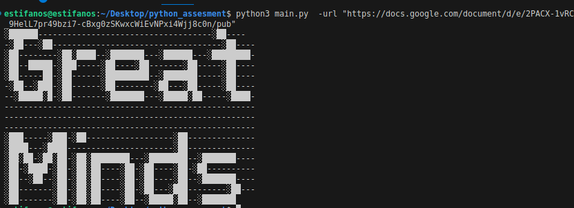

# ASCII Art Parser - Explanation

This script takes a URL that has an HTML table with x, char, and y columns, then turns it into ASCII art printed in the terminal.

---

## How it works

1. **Import required modules and libraries**
   It uses `HTMLParser` to read HTML, `requests` to get the web page, and `argparse` to handle command-line inputs.

2. **TableParser class**
   This class goes through the HTML tags. When it finds `<td>` tags, it reads the text inside and stores it.
   When a row `<tr>` is done and has exactly 3 columns (x, char, y), it saves that as one data point.

3. **Getting the HTML**
   `fetch_html()` downloads the page. If it fails, it shows an error and stops.

4. **Making the canvas**
   `build_canvas_from_rows()` looks at all the x and y values to figure out how big the art should be.
   It creates a grid filled with a chosen fill character (default is a space). Then it places each `char` at the correct position.

5. **Main function**

   * Reads the `-url`
   * Fetches the HTML.
   * Parses it with `TableParser` a custom class which inherits from `HTMLParsre` and overides the three methods.
   * Builds and prints the ASCII art.

---

## Example

### Linux based Os(mine)

```bash
python3 main.py -url "https://example.com/ascii_table.html" 
```

### Windows

```bash
python main.py -url "https://example.com/ascii_table.html"

